# System Architecture
## LCM Analytics MVP - Real Estate Intelligence Platform

### Document Information
- **Version**: 1.0
- **Date**: October 2024
- **Project**: LCM Analytics MVP

---

## 1. System Architecture Overview

The LCM Analytics MVP follows a hybrid full-stack architecture combining Next.js for the primary application with an optional Python FastAPI microservice for advanced analytics.

### 1.1 High-Level Architecture

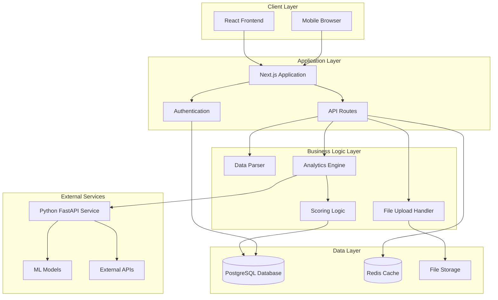

### 1.2 Component Architecture

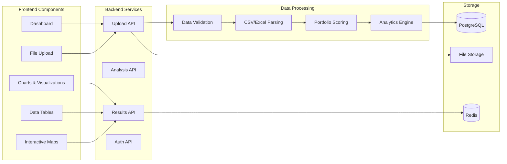

---

## 2. Data Flow Architecture

### 2.1 Primary Data Flow

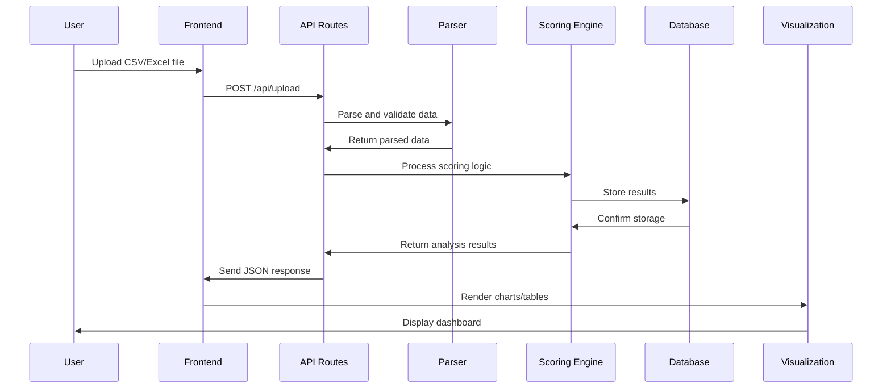

### 2.2 Analytics Processing Flow

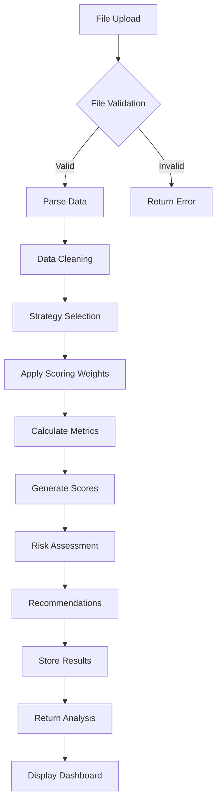

---

## 3. Technology Stack Architecture

### 3.1 Frontend Architecture

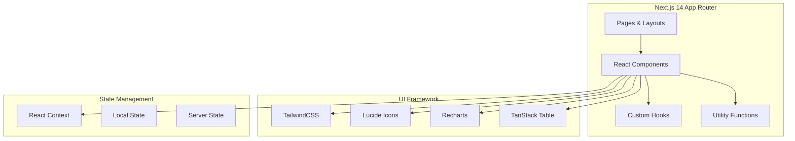

### 3.2 Backend Architecture

```mermaid
graph TB
    subgraph "Next.js API Routes"
        UploadRoute[/api/upload]
        AnalysisRoute[/api/analyze]
        ResultsRoute[/api/results]
        AuthRoute[/api/auth]
    end
    
    subgraph "Business Logic"
        FileHandler[File Handler]
        DataParser[Data Parser]
        ScoringEngine[Scoring Engine]
        AnalyticsEngine[Analytics Engine]
    end
    
    subgraph "Database Layer"
        Prisma[Prisma ORM]
        Migrations[Database Migrations]
        Queries[Query Builder]
    end
    
    subgraph "External Services"
        PythonAPI[Python FastAPI]
        MLModels[ML Models]
        ExternalAPIs[External APIs]
    end
    
    UploadRoute --> FileHandler
    AnalysisRoute --> DataParser
    AnalysisRoute --> ScoringEngine
    ResultsRoute --> AnalyticsEngine
    ScoringEngine --> Prisma
    AnalyticsEngine --> PythonAPI
    PythonAPI --> MLModels
    PythonAPI --> ExternalAPIs
```

---

## 4. Database Architecture

### 4.1 Entity Relationship Diagram

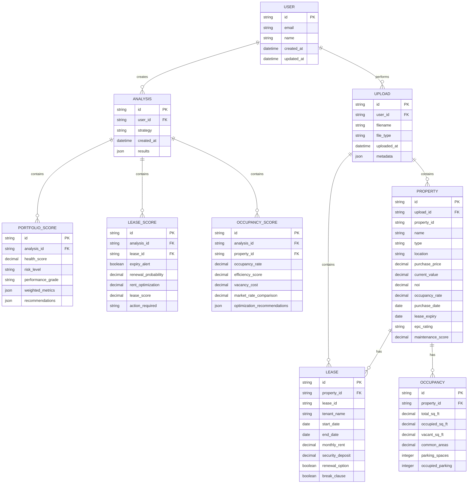

### 4.2 Database Schema Design

```sql
-- Core Tables
CREATE TABLE users (
    id VARCHAR(36) PRIMARY KEY,
    email VARCHAR(255) UNIQUE NOT NULL,
    name VARCHAR(255) NOT NULL,
    created_at TIMESTAMP DEFAULT CURRENT_TIMESTAMP,
    updated_at TIMESTAMP DEFAULT CURRENT_TIMESTAMP ON UPDATE CURRENT_TIMESTAMP
);

CREATE TABLE uploads (
    id VARCHAR(36) PRIMARY KEY,
    user_id VARCHAR(36) NOT NULL,
    filename VARCHAR(255) NOT NULL,
    file_type VARCHAR(50) NOT NULL,
    file_size BIGINT NOT NULL,
    uploaded_at TIMESTAMP DEFAULT CURRENT_TIMESTAMP,
    metadata JSON,
    FOREIGN KEY (user_id) REFERENCES users(id)
);

CREATE TABLE analyses (
    id VARCHAR(36) PRIMARY KEY,
    user_id VARCHAR(36) NOT NULL,
    upload_id VARCHAR(36) NOT NULL,
    strategy ENUM('growth', 'hold', 'divest') NOT NULL,
    created_at TIMESTAMP DEFAULT CURRENT_TIMESTAMP,
    results JSON,
    FOREIGN KEY (user_id) REFERENCES users(id),
    FOREIGN KEY (upload_id) REFERENCES uploads(id)
);

-- Property Data Tables
CREATE TABLE properties (
    id VARCHAR(36) PRIMARY KEY,
    upload_id VARCHAR(36) NOT NULL,
    property_id VARCHAR(100) NOT NULL,
    name VARCHAR(255) NOT NULL,
    type VARCHAR(50) NOT NULL,
    location VARCHAR(255) NOT NULL,
    purchase_price DECIMAL(15,2),
    current_value DECIMAL(15,2),
    noi DECIMAL(15,2),
    occupancy_rate DECIMAL(5,2),
    purchase_date DATE,
    lease_expiry_date DATE,
    epc_rating VARCHAR(10),
    maintenance_score DECIMAL(3,1),
    FOREIGN KEY (upload_id) REFERENCES uploads(id)
);

CREATE TABLE leases (
    id VARCHAR(36) PRIMARY KEY,
    property_id VARCHAR(36) NOT NULL,
    lease_id VARCHAR(100) NOT NULL,
    tenant_name VARCHAR(255) NOT NULL,
    start_date DATE NOT NULL,
    end_date DATE NOT NULL,
    monthly_rent DECIMAL(15,2) NOT NULL,
    security_deposit DECIMAL(15,2),
    renewal_option BOOLEAN DEFAULT FALSE,
    break_clause BOOLEAN DEFAULT FALSE,
    FOREIGN KEY (property_id) REFERENCES properties(id)
);

CREATE TABLE occupancy (
    id VARCHAR(36) PRIMARY KEY,
    property_id VARCHAR(36) NOT NULL,
    total_sq_ft DECIMAL(12,2) NOT NULL,
    occupied_sq_ft DECIMAL(12,2) NOT NULL,
    vacant_sq_ft DECIMAL(12,2) NOT NULL,
    common_areas DECIMAL(12,2),
    parking_spaces INTEGER,
    occupied_parking INTEGER,
    FOREIGN KEY (property_id) REFERENCES properties(id)
);

-- Scoring Tables
CREATE TABLE portfolio_scores (
    id VARCHAR(36) PRIMARY KEY,
    analysis_id VARCHAR(36) NOT NULL,
    health_score DECIMAL(5,2) NOT NULL,
    risk_level VARCHAR(20) NOT NULL,
    performance_grade VARCHAR(5) NOT NULL,
    weighted_metrics JSON NOT NULL,
    recommendations JSON,
    created_at TIMESTAMP DEFAULT CURRENT_TIMESTAMP,
    FOREIGN KEY (analysis_id) REFERENCES analyses(id)
);

CREATE TABLE lease_scores (
    id VARCHAR(36) PRIMARY KEY,
    analysis_id VARCHAR(36) NOT NULL,
    lease_id VARCHAR(36) NOT NULL,
    expiry_alert BOOLEAN NOT NULL,
    renewal_probability DECIMAL(5,2),
    rent_optimization DECIMAL(5,2),
    lease_score DECIMAL(5,2) NOT NULL,
    action_required VARCHAR(50),
    FOREIGN KEY (analysis_id) REFERENCES analyses(id),
    FOREIGN KEY (lease_id) REFERENCES leases(id)
);

CREATE TABLE occupancy_scores (
    id VARCHAR(36) PRIMARY KEY,
    analysis_id VARCHAR(36) NOT NULL,
    property_id VARCHAR(36) NOT NULL,
    occupancy_rate DECIMAL(5,2) NOT NULL,
    efficiency_score DECIMAL(5,2) NOT NULL,
    vacancy_cost DECIMAL(15,2),
    market_rate_comparison DECIMAL(5,2),
    optimization_recommendations JSON,
    FOREIGN KEY (analysis_id) REFERENCES analyses(id),
    FOREIGN KEY (property_id) REFERENCES properties(id)
);
```

---

## 5. API Architecture

### 5.1 REST API Endpoints

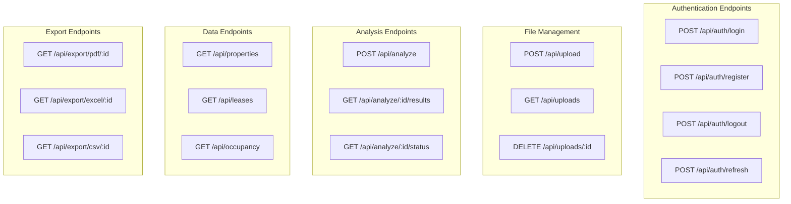

### 5.2 API Request/Response Flow

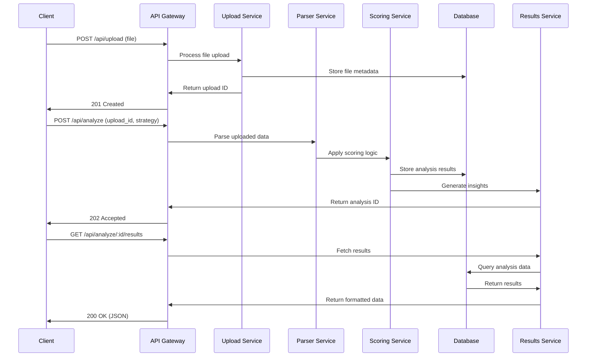

---

## 6. Security Architecture

### 6.1 Security Layers

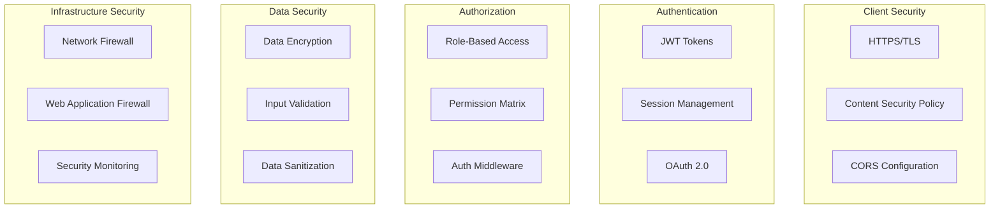

### 6.2 Security Implementation

```typescript
// Authentication Middleware
export async function authenticateToken(req: NextRequest) {
    const token = req.headers.get('authorization')?.replace('Bearer ', '');
    if (!token) return NextResponse.json({ error: 'No token provided' }, { status: 401 });
    
    try {
        const decoded = jwt.verify(token, process.env.JWT_SECRET!);
        return decoded;
    } catch (error) {
        return NextResponse.json({ error: 'Invalid token' }, { status: 401 });
    }
}

// File Upload Security
export async function validateFileUpload(file: File) {
    const allowedTypes = ['text/csv', 'application/vnd.ms-excel', 'application/vnd.openxmlformats-officedocument.spreadsheetml.sheet'];
    const maxSize = 50 * 1024 * 1024; // 50MB
    
    if (!allowedTypes.includes(file.type)) {
        throw new Error('Invalid file type');
    }
    
    if (file.size > maxSize) {
        throw new Error('File too large');
    }
    
    return true;
}

// Data Validation
export function validatePropertyData(data: any) {
    const schema = z.object({
        property_id: z.string().min(1),
        name: z.string().min(1),
        type: z.enum(['Office', 'Retail', 'Industrial', 'Residential']),
        location: z.string().min(1),
        purchase_price: z.number().positive(),
        current_value: z.number().positive(),
        noi: z.number(),
        occupancy_rate: z.number().min(0).max(1)
    });
    
    return schema.parse(data);
}
```

---

## 7. Deployment Architecture

### 7.1 Production Deployment

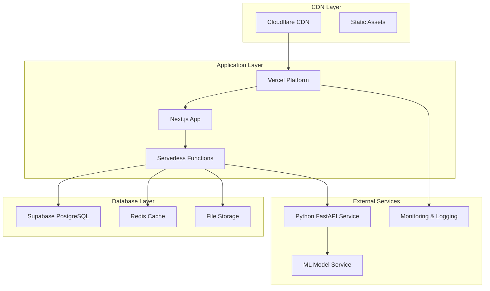

### 7.2 Development Environment

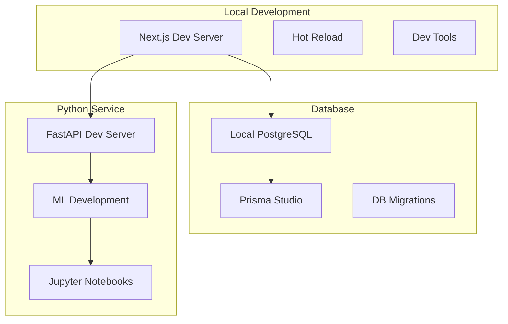

---

## 8. Monitoring and Observability

### 8.1 Monitoring Stack

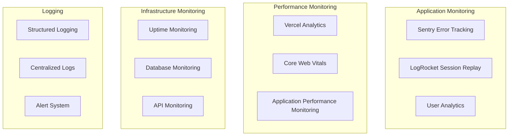

### 8.2 Health Checks

```typescript
// Health Check Endpoint
export async function GET() {
    const health = {
        status: 'healthy',
        timestamp: new Date().toISOString(),
        services: {
            database: await checkDatabase(),
            redis: await checkRedis(),
            python: await checkPythonService(),
            storage: await checkFileStorage()
        }
    };
    
    return NextResponse.json(health);
}

async function checkDatabase() {
    try {
        await prisma.$queryRaw`SELECT 1`;
        return { status: 'healthy', responseTime: Date.now() };
    } catch (error) {
        return { status: 'unhealthy', error: error.message };
    }
}
```

---

*This architecture document provides the foundation for implementing the LCM Analytics MVP with clear separation of concerns, scalable design patterns, and modern development practices.*
