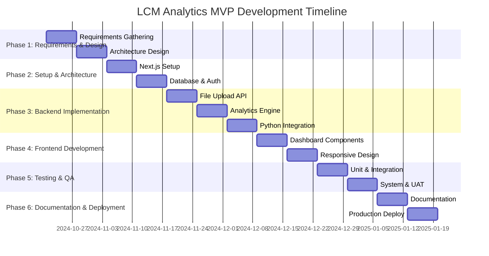

# System Development Stages Timeline
## LCM Analytics MVP - Real Estate Intelligence Platform

### Document Information
- **Version**: 1.0
- **Date**: October 2024
- **Project**: LCM Analytics MVP
- **Total Duration**: 12 weeks

---

## 1. Project Overview

### 1.1 Development Phases
The LCM Analytics MVP development is structured into 6 distinct phases, each with specific objectives, deliverables, and success criteria.

### 1.2 Team Structure
- **Project Manager**: 1 FTE
- **Full-Stack Developers**: 2 FTE
- **Frontend Developer**: 1 FTE
- **Backend Developer**: 1 FTE
- **Python Developer**: 0.5 FTE (optional)
- **DevOps Engineer**: 0.5 FTE
- **QA Engineer**: 1 FTE
- **UI/UX Designer**: 0.5 FTE

---

## 2. Phase 1: Requirements & Design (Weeks 1-2)

### 2.1 Objectives
- Define system requirements and specifications
- Create detailed technical architecture
- Establish development standards and guidelines
- Set up project infrastructure

### 2.2 Key Activities

| Week | Activities | Deliverables | Owner |
|------|------------|--------------|-------|
| 1 | Requirements gathering, stakeholder interviews, technical research | SRS Document, Architecture Design | PM + Lead Dev |
| 2 | Database design, API specification, UI/UX wireframes | Database Schema, API Docs, Wireframes | Backend Dev + Designer |

### 2.3 Deliverables
- ✅ System Requirements Specification (SRS)
- ✅ Technical Architecture Document
- ✅ Database Schema Design
- ✅ API Endpoint Specifications
- ✅ UI/UX Wireframes and Mockups
- ✅ Development Environment Setup
- ✅ Project Repository Structure

### 2.4 Success Criteria
- All stakeholders approve requirements
- Technical architecture validated
- Development environment ready
- Team onboarding completed

---

## 3. Phase 2: Setup & Architecture (Weeks 3-4)

### 3.1 Objectives
- Initialize Next.js application with proper structure
- Set up database and ORM configuration
- Implement authentication system
- Create basic UI components and layouts

### 3.2 Key Activities

| Week | Activities | Deliverables | Owner |
|------|------------|--------------|-------|
| 3 | Next.js setup, database configuration, authentication implementation | Working Next.js app, Database setup, Auth system | Full-Stack Team |
| 4 | UI component library, basic layouts, routing structure | Component library, Layout system, Navigation | Frontend Dev |

### 3.3 Deliverables
- ✅ Next.js 14 application with App Router
- ✅ PostgreSQL database with Prisma ORM
- ✅ Authentication system (NextAuth.js)
- ✅ TailwindCSS styling system
- ✅ Component library and design system
- ✅ Basic routing and navigation
- ✅ Development and testing environment

### 3.4 Success Criteria
- Application runs locally without errors
- Database connections established
- Authentication flow working
- Basic UI components functional
- Development workflow established

---

## 4. Phase 3: Backend Implementation (Weeks 5-7)

### 4.1 Objectives
- Implement file upload and processing APIs
- Develop analytics engine and scoring logic
- Create data validation and parsing services
- Integrate Python FastAPI service (optional)

### 4.2 Key Activities

| Week | Activities | Deliverables | Owner |
|------|------------|--------------|-------|
| 5 | File upload API, data parsing, validation services | Upload endpoints, Data processors, Validation logic | Backend Dev |
| 6 | Analytics engine, scoring algorithms, recommendation system | Analytics service, Scoring logic, Recommendations | Backend Dev + Python Dev |
| 7 | Python service integration, API optimization, error handling | Python service, API integration, Error handling | Python Dev + Backend Dev |

### 4.3 Deliverables
- ✅ File upload API endpoints
- ✅ CSV/Excel parsing and validation
- ✅ Portfolio analytics engine
- ✅ Scoring algorithms (JavaScript and Python)
- ✅ Recommendation generation system
- ✅ Python FastAPI microservice (optional)
- ✅ API error handling and logging
- ✅ Database operations and queries

### 4.4 Success Criteria
- File upload and processing working
- Analytics calculations accurate
- API responses within performance targets
- Error handling comprehensive
- Python service integrated (if implemented)

---

## 5. Phase 4: Frontend Development (Weeks 8-9)

### 5.1 Objectives
- Implement dashboard and visualization components
- Create data tables and interactive charts
- Develop user interface for all modules
- Implement responsive design

### 5.2 Key Activities

| Week | Activities | Deliverables | Owner |
|------|------------|--------------|-------|
| 8 | Dashboard components, charts, data tables | Dashboard UI, Chart components, Data tables | Frontend Dev |
| 9 | Responsive design, user interactions, export functionality | Mobile responsiveness, Interactive features, Export UI | Frontend Dev + UI/UX |

### 5.3 Deliverables
- ✅ Portfolio dashboard with health scores
- ✅ Interactive charts and visualizations
- ✅ Data tables with sorting and filtering
- ✅ Lease analysis interface
- ✅ Occupancy management interface
- ✅ Export functionality (PDF/Excel)
- ✅ Responsive mobile design
- ✅ User interaction features

### 5.4 Success Criteria
- All UI components functional
- Charts and visualizations accurate
- Responsive design working across devices
- User interactions smooth and intuitive
- Export functionality operational

---

## 6. Phase 5: Testing & QA (Weeks 10-11)

### 6.1 Objectives
- Execute comprehensive testing suite
- Perform system integration testing
- Conduct user acceptance testing
- Optimize performance and security

### 6.2 Key Activities

| Week | Activities | Deliverables | Owner |
|------|------------|--------------|-------|
| 10 | Unit testing, integration testing, API testing | Test results, Bug reports, Performance metrics | QA Engineer + Dev Team |
| 11 | System testing, UAT, security testing, performance optimization | System test results, UAT sign-off, Security audit | QA Engineer + DevOps |

### 6.3 Deliverables
- ✅ Unit test suite (80%+ coverage)
- ✅ Integration test results
- ✅ End-to-end test automation
- ✅ Performance test results
- ✅ Security audit report
- ✅ User acceptance testing results
- ✅ Bug fixes and optimizations
- ✅ Production deployment configuration

### 6.4 Success Criteria
- All tests passing
- Performance targets met
- Security vulnerabilities addressed
- User acceptance criteria satisfied
- System ready for production

---

## 7. Phase 6: Documentation & Deployment (Week 12)

### 7.1 Objectives
- Complete technical documentation
- Deploy to production environment
- Conduct final system validation
- Prepare handover materials

### 7.2 Key Activities

| Week | Activities | Deliverables | Owner |
|------|------------|--------------|-------|
| 12 | Documentation completion, production deployment, final testing, handover | Final docs, Production system, Handover materials | All Team Members |

### 7.3 Deliverables
- ✅ Complete technical documentation
- ✅ User manual and guides
- ✅ API documentation
- ✅ Production deployment
- ✅ System monitoring setup
- ✅ Handover documentation
- ✅ Training materials

### 7.4 Success Criteria
- Documentation complete and reviewed
- Production system operational
- Monitoring and alerting configured
- Team trained on system maintenance
- Project successfully delivered

---

## 8. Detailed Timeline

### 8.1 Week-by-Week Breakdown

### 8.2 Milestone Schedule

| Milestone | Target Date | Deliverable | Success Criteria |
|-----------|-------------|-------------|------------------|
| M1: Requirements Complete | Week 2 | SRS + Architecture | Stakeholder approval |
| M2: MVP Setup Complete | Week 4 | Working application | Local development ready |
| M3: Backend Complete | Week 7 | All APIs functional | Backend services operational |
| M4: Frontend Complete | Week 9 | Full UI implemented | User interface complete |
| M5: Testing Complete | Week 11 | All tests passing | Quality gates met |
| M6: Production Ready | Week 12 | Live system | Production deployment |

---

## 9. Resource Allocation

### 9.1 Team Allocation by Phase

| Phase | PM | Full-Stack | Frontend | Backend | Python | DevOps | QA | Designer |
|-------|----|-----------|----------|---------|--------|--------|----|---------| 
| Phase 1 | 100% | 50% | 0% | 50% | 0% | 0% | 0% | 100% |
| Phase 2 | 50% | 100% | 100% | 100% | 0% | 50% | 0% | 50% |
| Phase 3 | 25% | 75% | 25% | 100% | 100% | 25% | 25% | 0% |
| Phase 4 | 25% | 50% | 100% | 25% | 0% | 25% | 25% | 100% |
| Phase 5 | 50% | 25% | 25% | 25% | 0% | 50% | 100% | 0% |
| Phase 6 | 100% | 50% | 25% | 25% | 0% | 100% | 50% | 0% |

### 9.2 Critical Path Analysis

| Task | Duration | Dependencies | Critical Path |
|------|----------|---------------|---------------|
| Requirements & Design | 2 weeks | None | ✅ Yes |
| Database Setup | 1 week | Requirements | ✅ Yes |
| Authentication | 1 week | Database | ✅ Yes |
| File Upload API | 1 week | Auth | ✅ Yes |
| Analytics Engine | 2 weeks | Upload API | ✅ Yes |
| Dashboard UI | 2 weeks | Analytics | ✅ Yes |
| Testing | 2 weeks | Dashboard | ✅ Yes |
| Deployment | 1 week | Testing | ✅ Yes |

---

## 10. Risk Management

### 10.1 Identified Risks

| Risk | Probability | Impact | Mitigation Strategy |
|------|-------------|--------|-------------------|
| Technical complexity underestimated | Medium | High | Regular technical reviews, buffer time |
| Python service integration issues | Medium | Medium | Fallback to JavaScript-only implementation |
| Performance issues with large datasets | Low | High | Early performance testing, optimization |
| Third-party service dependencies | Low | Medium | Backup solutions, service monitoring |
| Team availability issues | Medium | High | Cross-training, documentation |

### 10.2 Contingency Plans

| Scenario | Contingency Plan | Timeline Impact |
|----------|------------------|-----------------|
| Python service not ready | Use JavaScript analytics only | +1 week |
| Performance issues | Optimize algorithms, add caching | +1 week |
| Team member unavailable | Redistribute work, hire contractor | +2 weeks |
| Integration problems | Simplify architecture | +1 week |

---

## 11. Quality Gates

### 11.1 Phase Gate Criteria

| Phase | Gate Criteria | Approval Required |
|-------|---------------|-------------------|
| Phase 1 | Requirements approved, architecture validated | Stakeholders + Tech Lead |
| Phase 2 | Application runs, database connected, auth working | Tech Lead + DevOps |
| Phase 3 | All APIs functional, analytics accurate | Backend Lead + QA |
| Phase 4 | UI complete, responsive, user-friendly | Frontend Lead + Designer |
| Phase 5 | All tests passing, performance targets met | QA Lead + Tech Lead |
| Phase 6 | Production deployed, documentation complete | Project Manager + Stakeholders |

### 11.2 Quality Metrics

| Metric | Target | Measurement |
|--------|--------|-------------|
| Code Coverage | 80% | Automated testing |
| Performance | < 3s page load | Load testing |
| Security | Zero critical vulnerabilities | Security audit |
| Usability | < 10 min to complete analysis | User testing |
| Reliability | 99.5% uptime | Monitoring |

---

## 12. Communication Plan

### 12.1 Regular Meetings

| Meeting | Frequency | Participants | Purpose |
|---------|-----------|--------------|---------|
| Daily Standup | Daily | Dev Team | Progress updates, blockers |
| Weekly Sprint Review | Weekly | All Team | Demo progress, gather feedback |
| Bi-weekly Stakeholder Review | Bi-weekly | Stakeholders + PM | Progress reporting |
| Monthly Architecture Review | Monthly | Tech Leads | Technical decisions |

### 12.2 Reporting Schedule

| Report | Frequency | Recipients | Content |
|--------|-----------|------------|---------|
| Progress Report | Weekly | Stakeholders | Milestone progress, risks |
| Technical Status | Bi-weekly | Tech Team | Technical achievements, issues |
| Quality Report | Weekly | QA + Dev Leads | Test results, bug status |
| Budget Report | Monthly | Project Manager | Resource utilization, costs |

---

## 13. Success Metrics

### 13.1 Technical Success Criteria

| Criteria | Target | Measurement Method |
|----------|--------|-------------------|
| Functionality | All requirements met | Requirements traceability |
| Performance | < 3s response time | Load testing |
| Reliability | 99.5% uptime | Monitoring |
| Security | Zero critical vulnerabilities | Security testing |
| Usability | User satisfaction > 4/5 | User feedback |

### 13.2 Business Success Criteria

| Criteria | Target | Measurement Method |
|----------|--------|-------------------|
| User Adoption | 10+ beta users | User analytics |
| Data Accuracy | 95% calculation accuracy | Manual verification |
| Time to Value | < 10 minutes to complete analysis | User testing |
| User Satisfaction | Positive feedback from 80% users | User surveys |

---

*This timeline provides a comprehensive roadmap for delivering the LCM Analytics MVP within 12 weeks, with clear milestones, deliverables, and success criteria for each phase.*
